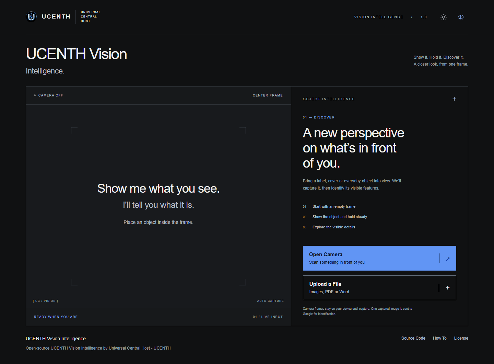

# UCENTH Vision Intelligence

**Open-source UCENTH Vision Intelligence by Universal Central Host - UCENTH.** Hold a subject steady, capture one real photograph, and explore a cautious Gemini identification.



[How To](how-to.html) · [Source Code](https://github.com/Ucenth/ucenth-vision-intelligence) · [License](LICENSE) · [Report an issue](https://github.com/Ucenth/ucenth-vision-intelligence/issues) · [Third-party notices](THIRD-PARTY-NOTICES.md)

## Start here

Open [how-to.html](how-to.html) from your downloaded folder. It is both the installation guide (Windows PowerShell, macOS/Linux, Google Cloud, authentication, troubleshooting) and a course in how UCENTH Vision Intelligence was built: camera capture, Gemini integration, structured prompts, people-from-context, documents, voice, particles and security, with mini-lessons for reusing each capability in your own project. The scanner itself runs at **http://localhost:3000**, not by opening index.html directly.

Requirements: Node **22.19+** with npm (tested on **26.5.0 / Windows**), Chrome, a camera, internet access, and a Google Cloud project with billing, Agent Platform API (formerly Vertex AI API), Cloud Text-to-Speech API and access to Gemini 3.8 Flash. Hands-free conversation also needs a microphone and speakers/headphones. Typed questions remain available without microphone access.

After installing Google Cloud CLI, signing in with ADC and enabling `aiplatform.googleapis.com` and `texttospeech.googleapis.com` as explained in the guide:

```sh
git clone https://github.com/Ucenth/ucenth-vision-intelligence.git
cd ucenth-vision-intelligence
npm ci
```

Copy `.env.example` to `.env` and set your own `GOOGLE_CLOUD_PROJECT`. Leave `PORT=3000` for the documented URL. Then:

```sh
npm start
```

PowerShell execution-policy issue? Use `npm.cmd` and `gcloud.cmd`. Credentials are discovered by Google's SDK; never paste an access token into `.env`.

## What it does

- Automatic stability lock and 3–2–1 capture; meaningful movement cancels the lock.
- Preserves the captured photograph while a separate canvas creates the visual scan effect.
- Sends the original capture to Gemini 3.8 Flash through a local Node server.
- Selects the intentionally presented subject, including a person or a product held forward.
- Presents a readable report with up to five observations, conservative uncertainty and a useful next-view instruction.
- Accepts JPEG/PNG uploads under 2 MB, PDF files up to 15 MB and 60 pages, and Word (.docx) files up to 10 MB through one **Upload a File** control.
- Document intelligence: a photographed, scanned or uploaded document is recognized by broad type (receipt, invoice, letter, form, certificate, statement, report, menu, resume, contract and more), its language is detected, key fields and a summary are extracted, and non-English content gets an English translation shown beside the original with Original / English tabs and page navigation.
- Contextual person intelligence: when the image contains a person, identity is reported only if non-biometric context supplied with the image establishes it, such as a caption directly under the photograph, a profile or leadership card, or an article heading. Otherwise the result is **PERSON DETECTED** with a description of what is visible. Faces are never matched or recognized.
- Introduces the identified object using Google Cloud's Charon voice, then listens automatically for questions about that object.
- Displays live transcription and the current answer beside an organic WebGL particle presence driven by actual microphone/playback audio.
- Keeps the original photograph and identification available; only the latest exchange is prominent. Up to six recent messages accompany a follow-up request.

## People in images

UCENTH Vision Intelligence can identify a person only when the supplied image or page contains sufficient contextual identity information that is clearly associated with the pictured person. It does not identify real people from facial appearance alone, however famous they may be, and it contains no face-recognition library, face embeddings, biometric database or reverse-face search. A name that merely appears somewhere in a screenshot is not treated as an identification; with several names or several people, the result stays **PERSON DETECTED** unless each association is explicit. An established identity shows a restrained basis line such as *Identified from page context*, with the supporting evidence under **View full analysis**. Charon then introduces the person by name; otherwise it explains that identity is not established and offers to describe what is visible. If you state who the person is during the conversation, that name is used as your own context for later answers, labelled as user-provided rather than verified. Sensitive personal attributes are never inferred.

## Documents

Upload a PDF or Word file, or photograph a paper document, and UCENTH Vision Intelligence routes it to document intelligence automatically; objects and people keep their own pipelines, so no mode switch is needed. A resume with a portrait is treated as a document. The result shows the document type, language(s), page count, a summary, key details and the document text. For PDFs, pages with selectable text are extracted locally with PDF.js and sent as text; scanned pages are read by Gemini from the PDF itself; mixed files combine both. Word files are parsed with mammoth into paragraphs, headings, lists and tables; macros and embedded content are never executed, and embedded images are not analyzed. Limits: PDFs up to 15 MB and 60 pages, of which up to 25 may be scanned; Word files up to 10 MB; about 200,000 characters of text. Oversized or unreadable files produce a clear message.

English documents are not translated. For other languages the English translation is prepared for the first pages up to a bounded amount; ask in conversation to translate further pages or specific passages. The Original view keeps its own direction (right-to-left for Arabic, Hebrew, Persian and Urdu) and script; English is never mirrored. Extracted values are read from the document, never invented: unclear values are marked uncertain or omitted, so check important figures against the original. Charon then introduces the document, mentioning translation only when one was made, and the hands-free conversation answers from the document's text, translation, summary and fields, including page-specific questions. The document context lives only in the current session and is cleared by Scan another object.

## Conversation controls

After the introduction, wait for **LISTENING**, then ask about the captured object. The recognized question and original photograph go to Gemini. **THINKING** stays visible while Gemini answers and Charon prepares speech. The complete answer appears immediately before playback begins. If speech fails or takes more than 25 seconds to prepare, the successful text answer appears with a voice-unavailable notice. Microphone capture and recognition are stopped throughout playback; listening resumes after playback and the existing 900 ms echo guard.

Begin speaking within five seconds of **LISTENING**. If speech does not start, microphone tracks and recognition stop and **Conversation paused** appears. **Continue conversation** deliberately opens a new listening period; it never restarts automatically after silence. Once speech begins, the five-second timer is cancelled so it does not truncate the utterance. Typed questions still work while paused and can return to automatic listening after Charon's answer.

**Pause microphone** stops listening; **Voice off** stops speech and automatic listening and saves that preference locally. **Type a question** works without speech recognition. **End conversation**, **Scan another object**, leaving the page or hiding the tab stops conversation resources. End releases the particle renderer; Resume recreates it. If Charon fails, the written answer remains and no substitute voice is used.

Desktop uses up to 12,000 GPU particles; mobile uses 6,000 at 30 fps and lower-power mode 3,600 at 30 fps. Reduced-motion preferences reduce movement and density. A Canvas fallback retains a real audio-level response if WebGL is unavailable. See [architecture](ARCHITECTURE.md).

## Educational edition

This source is written to be learned from. Every file carries explanatory comments about intent and reasoning, not line-by-line narration: the camera pipeline, the Gemini integration and why credentials never touch the browser, the prompt architecture, structured output, people-from-context, document parsing and file security, the voice state machine, the five-second timeout, the audio-reactive particles, and the state and error handling that keep the app honest when things fail. The [How To guide](how-to.html) turns those comments into a course with real excerpts, "Why?", "Try this" and "Common mistake" callouts, and mini-lessons for reusing the camera, Gemini, voice, document and particle capabilities in your own project.

Code blocks in the guide labelled *from UCENTH Vision Intelligence source* are copied from regions marked `// how-to:start <id>` … `// how-to:end <id>` in the code and verified by `scripts/how-to-sync.js` during `npm test` and `npm run release:check`, so a changed implementation cannot ship with a stale teaching example; after changing a marked region, run `npm run howto:sync` and re-read the lesson. Blocks labelled *simplified example* are intentionally independent teaching versions and are not compared.

The downloadable ZIP that UCENTH's website offers as **Download Source Code** is produced by `npm run release:prepare` from the explicit allowlist in `scripts/release-files.js`: source, the How To guide, README, license, notices and `.env.example`. It never contains `.env`, credentials, private tests, `.local`, captures or hosted-service secrets. GitHub remains the canonical repository.

The hosted UCENTH service may apply its own usage limits and abuse controls to protect shared cloud resources. Those operational controls are not part of this open-source learning edition; the small local limits in `server.js` exist only to protect your own billing.

## Read the code

```text
Camera → stability → 3 · 2 · 1 → capture → visual scan
                                      ↓
                        local Node → Gemini → report
```

| File | What to look for |
|---|---|
| `script.js` | Camera lifecycle, captureSource, displayIdentity and reset |
| `lib/stability.js` | Small-frame motion comparison and countdown cancellation |
| `server.js` | Local API, image validation, rate limiting and safe errors |
| `lib/gemini.js` | ADC, the unchanged model request settings and response validation |
| `lib/identity-prompt.js` | Subject selection, conservative identification, contextual person rules and JSON schema |
| `voice.js`, `voice.css` | Conversation states, microphone/playback lifecycle and compact presentation |
| `lib/particle-presence.js` | Reviewed renderer, real audio analysis and quality modes |
| `document.js`, `document.css` | Document result, Original / English tabs, page navigation and document surface tokens |
| `lib/document.js`, `lib/document-routes.js` | File validation by magic bytes, PDF/DOCX extraction, bounded analysis and the in-memory `/api/document` route |
| `lib/conversation.js`, `lib/voice-routes.js` | Separate follow-up/TTS clients, bounded inputs and safe errors |
| `index.html`, `style.css` | Branding, scanner copy and result layout |
| `how-to.html`, `how-to.css`, `how-to.js` | The How To guide: installation, engineering lessons, copy buttons, search and scroll-spy |

No framework, database, account system or frontend build step. The model/prompt is easy to find; there is no configuration framework.

## Privacy and security

Starting the camera arms automatic scanning after browser permission. A stable change in the center frame triggers the countdown; Stop camera disarms it. Only the captured still is sent to the local server and then Google Cloud. Live video is not sent to Google. Normal use keeps photos/responses in memory, without saving them to disk. The photo stays visible until reset or page close. Tracks stop after capture, on stop/reset and page cleanup; hiding the page pauses a live/locking camera.

Uploaded or photographed document content, including extracted text, is sent to Google's Gemini service for analysis and translation; processing is not local. Files are handled in memory, never written to disk or kept after the session, and each new scan clears the document, translation and conversation context. Think before uploading highly sensitive documents such as identification, medical or financial records: they are useful to analyze, but they do leave your device for Google's service under its data policies.

Person identification uses only contextual text and layout inside the captured image, never facial features. Images that contain people are still sent to Gemini for description; scan pages or photographs of people only when you are comfortable sending them to Google.

Microphone access requires browser permission. Where the browser offers speech recognition (Chrome on desktop and Android, Safari), its service may send microphone audio to the browser vendor for transcription; speech recognition is not claimed to be local. On phones the recognizer owns the microphone alone, so the particle field shows a restrained listening pulse instead of a live microphone analysis. Browsers without a usable recognizer (for example Chrome on iOS) record each question as a short clip and send it to the local server's `/api/transcribe` route, which transcribes it with Gemini in memory; the clip is discarded immediately and never written to disk or logged. UCENTH Vision Intelligence does not intentionally record or save raw microphone audio. Recognized questions, the original captured image, identification and bounded recent conversation go to Gemini/Google Cloud. Answer text goes to Google Cloud Text-to-Speech. These values remain in application memory during normal use. Microphone tracks and recognition stop before Charon playback, when muted/ended/reset and on page cleanup.

ADC stays outside the project and is used server-side. Credentials are never returned to the browser. The server binds to loopback and checks Host/Origin, uses a public-file allowlist and validates decoded JPEG/PNG images (2 MB, 16 MP). Identification allows one active request and six attempts per minute; follow-up and speech each allow one active request, with limits of 12 and 18 attempts per minute respectively. It reports safe errors, not raw provider messages. This is a local educational app, not a hardened public hosting service.

Google's processing is governed by its [data policies](https://cloud.google.com/vertex-ai/generative-ai/docs/data-governance); this project does not promise zero cloud retention. Do not scan private material you do not want sent to Google. Developer browser tests deliberately write screenshots to ignored `artifacts/`.

## Limits

Visual identification can be wrong. Similar models may need another angle; confidence is not a measured probability. Each scan is independent: next-view suggestions do **not** combine images across scans. The prompt prohibits identifying people and inferring sensitive personal attributes, but this is an instruction to a model, not a formal guarantee. Motion detection is not semantic object detection.

Background removal is intentionally excluded after unreliable experimental masks. There are no segmentation assets, Web Detection/OCR dependencies or search-grounding calls. The scan animation does not change the image sent to Gemini. The source is open source; Google's hosted model/service is not part of the MIT-licensed code and can incur charges.

## Test and prepare a release

```sh
npm test
npm run test:browser
npm run release:check
npm run release:prepare
```

Browser tests require installed Google Chrome and a running app. They use synthetic camera frames and explicit mocked model responses; they do not measure identification accuracy. For a real, billable request through the running server, provide your own image:

```sh
npm run test:real -- path/to/your-image.jpg
```

`npm run test:document` runs the billable document suite: synthetic receipts, letters, invoices, a 12-page contract, scanned and mixed PDFs and Word files in English, French, Spanish, German, Portuguese, Italian, Arabic, Chinese, Japanese and Korean, with translation-fidelity and question checks, all generated at run time. `npm run test:person` runs the billable contextual-person suite: it builds eight fixtures at run time from openly licensed photographs and local HTML pages, sends them to your running server, and keeps downloads only under ignored `artifacts/`.

The real test writes no image or response artifacts and prints only a small summary. Do not add private photos to the repository. Release preparation copies only the explicit allowlist into `release/ucenth-vision-intelligence`; inspect that clean folder before publishing. Never ZIP the entire development workspace. No publication is automatic.

## License and contribution

UCENTH's code is [MIT licensed](LICENSE). Study, modify, reuse and share it while retaining the copyright/license notice. Dependencies keep their own licenses, including Apache and LGPL components: [third-party notices](THIRD-PARTY-NOTICES.md).

Report reproducible bugs or propose improvements through [GitHub Issues](https://github.com/Ucenth/ucenth-vision-intelligence/issues). Never include private images, tokens or credential files. The [official repository](https://github.com/Ucenth/ucenth-vision-intelligence) is the canonical source; use Code → Download ZIP or the clone command above.
